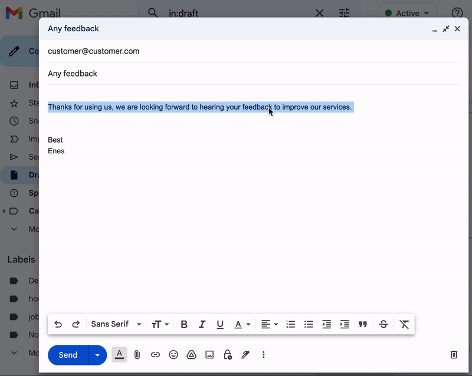

## Say It Better

A [Chrome extension](https://chrome.google.com/webstore/detail/say-it-better/jjmeigcgllplllpdnmbbigmepfmofcif) that prompts ChatGPT to enhance the selected text and enhance your writing skills.

Stack:
- API: OpenAI `gpt-3.5-turbo`
- Runtime: [Vercel Edge](https://vercel.com/features/edge-functions)
- Rate limiting and caching: [Upstash Redis](https://upstash.com/) 

### Usage
- Install [the extension](https://chrome.google.com/webstore/detail/say-it-better/jjmeigcgllplllpdnmbbigmepfmofcif).
  
- Select any text in your browser, right click and select `Say It Better`.

- The improved version of your text will be copied to your clipboard.

